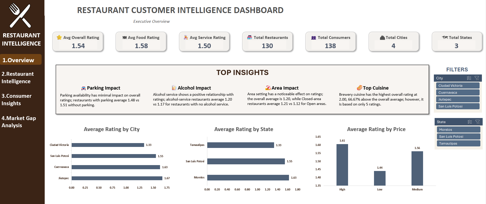
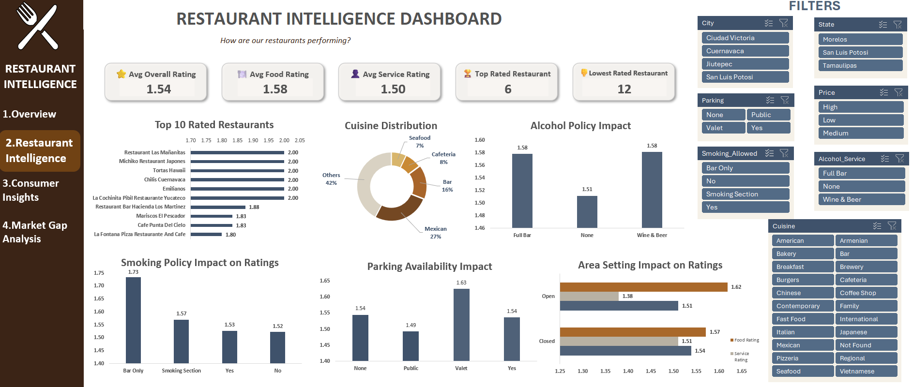
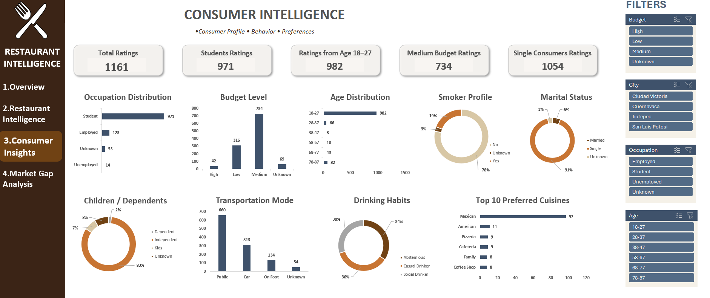
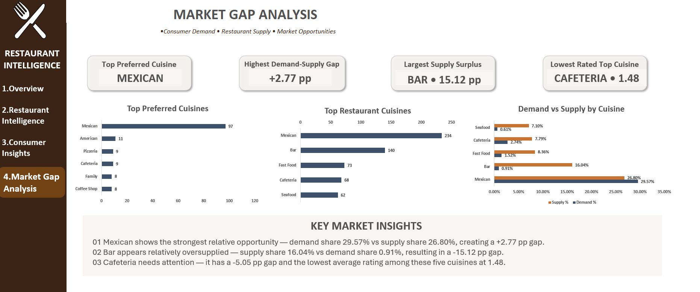

## Restaurant Customer Intelligence Dashboard

An interactive Excel-based analytics project built using the Maven Analytics Restaurant Ratings dataset.

The project analyzes restaurant performance, consumer behavior, cuisine preferences, and demand-supply differences to generate business-oriented insights through four connected dashboards.

---

## 📌 Project Overview

This project transforms raw restaurant and consumer datasets into an interactive Excel dashboard solution.

The analysis covers:

- Restaurant ratings and performance
- Restaurant policies and characteristics
- Consumer demographics and behavior
- Consumer cuisine preferences
- Restaurant cuisine supply
- Consumer demand vs restaurant supply
- Potential cuisine market gaps

The goal was not only to visualize the data, but also to identify meaningful patterns and translate them into business insights.

---

## 🎯 Business Questions

The project answers the following business questions:

| BQ | Business Question | Dashboard |
|---|---|---|
| BQ-01 | How do restaurant ratings vary across cities and states? | Executive Overview |
| BQ-02 | Which restaurants have the highest overall ratings? | Restaurant Intelligence |
| BQ-03 | How do restaurant policies and settings relate to overall ratings? | Restaurant Intelligence |
| BQ-04 | How is restaurant cuisine supply distributed across different cuisines? | Restaurant Intelligence |
| BQ-05 | What are the dominant consumer demographics, behaviors, and spending patterns? | Consumer Intelligence |
| BQ-06 | Which cuisines are most preferred by consumers? | Consumer Intelligence |
| BQ-07 | Where do consumer demand and restaurant supply differ by cuisine? | Market Gap Analysis |
| BQ-08 | Which cuisines show both market gaps and potential rating concerns? | Market Gap Analysis |

---

# 📊 Dashboards

## 1. Executive Overview

Provides a high-level view of restaurant performance across cities, states, price levels, and restaurant characteristics.

**Includes:**
- Overall, Food & Service Rating KPIs
- Total Restaurants
- Total Consumers
- Total Cities & States
- Average Rating by City
- Average Rating by State
- Average Rating by Price
- Parking, Alcohol and Area insights
- Interactive City and State slicers

### Preview

---

## 2. Restaurant Intelligence

Focuses on restaurant-level performance and operational characteristics.

**Includes:**
- Top 10 Rated Restaurants
- Cuisine Distribution
- Alcohol Policy Impact
- Smoking Policy Impact
- Parking Availability Impact
- Area Setting Impact
- Interactive restaurant filters

### Preview

---

## 3. Consumer Intelligence

Analyzes consumer demographics, behavior, spending patterns, and cuisine preferences.

**Includes:**
- Occupation Distribution
- Budget Level
- Age Distribution
- Smoker Profile
- Marital Status
- Children / Dependents
- Transportation Mode
- Drinking Habits
- Top Preferred Cuisines
- Interactive City, Budget, Occupation and Age slicers

### Preview

---

## 4. Market Gap Analysis

Compares consumer cuisine demand with restaurant cuisine supply.

**Includes:**
- Top Preferred Cuisines
- Top Restaurant Cuisines
- Demand vs Supply by Cuisine
- Demand-Supply Gap Analysis
- Average Rating of Analyzed Cuisines

### Preview

---

# 🔍 Key Insights

### Restaurant Performance

- Overall average rating: **1.54**
- Food rating: **1.58**
- Service rating: **1.50**
- Ratings varied across cities, states, price levels and restaurant characteristics.
- Among the analyzed price levels, High-price restaurants had the highest average rating at **1.61**.

### Consumer Profile

- Total rating records analyzed: **1,161**
- Student rating records: **971**
- Rating records from consumers aged 18–27: **982**
- Medium-budget rating records: **734**
- Single consumer rating records: **1,054**
- Public transportation was the most common transportation mode with **660** rating records.

### Cuisine Preferences

- Mexican cuisine had the highest consumer preference count with **97 records**.
- Other notable preferences included American, Pizzeria, Cafeteria, Family and Coffee Shop.

### Market Gap

Using the full cuisine preference and restaurant cuisine datasets:

- **Mexican:** 29.57% demand vs 26.80% supply → **+2.77 percentage-point gap**
- **Bar:** 0.91% demand vs 16.04% supply → **-15.12 percentage-point gap**
- **Fast Food:** **-6.84 percentage-point gap**
- **Seafood:** **-6.49 percentage-point gap**
- **Cafeteria:** **-5.05 percentage-point gap**

Cafeteria had the lowest average rating among the five analyzed top-supply cuisines at **1.48**.

> Note: Cuisine supply is based on cuisine records/tags rather than unique restaurants. Demand and supply percentages use their respective dataset totals.

---

# 🧹 Data Preparation

The project involved preparing five related datasets:

- Consumers
- Restaurants
- Ratings
- Restaurant Cuisines
- Consumer Preferences

### Data preparation steps included:

- Converted source datasets into Excel Tables
- Removed duplicate records from Consumer Preferences
- Reviewed missing values
- Added `Unknown` for applicable missing categorical values
- Retained missing ZIP codes where appropriate
- Verified data types
- Standardized category/text values
- Verified Consumer_ID and Restaurant_ID relationships
- Prepared lookup-based analysis fields
- Created PivotTables for business analysis
- Built KPI calculations and dashboard-ready analysis tables

---

# 🛠️ Tools & Skills

### Tools

- Microsoft Excel
- PivotTables
- PivotCharts
- Excel Slicers
- XLOOKUP
- Excel Tables
- Data Cleaning
- Dashboard Design
- Business Analysis

### Skills Demonstrated

- Data cleaning and preparation
- Exploratory data analysis
- KPI development
- PivotTable analysis
- Interactive dashboard creation
- Consumer segmentation
- Restaurant performance analysis
- Demand-supply analysis
- Business question formulation
- Insight generation

---
# 📸 Dashboard Preview

The project contains four interactive dashboards covering:

**Executive Overview → Restaurant Intelligence → Consumer Intelligence → Market Gap Analysis**

Each dashboard was designed with a consistent visual theme, interactive slicers, KPI cards, PivotCharts and business-focused insights.

---

# 📌 Dataset

Dataset: **Maven Analytics – Restaurant Ratings Challenge**

The dataset contains information about consumers, restaurants, ratings, restaurant cuisines and consumer preferences.

---

## Author

**Ayesha Firdous**

B.E. | Data Analytics Enthusiast

Interested in Excel, SQL, Power BI and data-driven business analysis.
